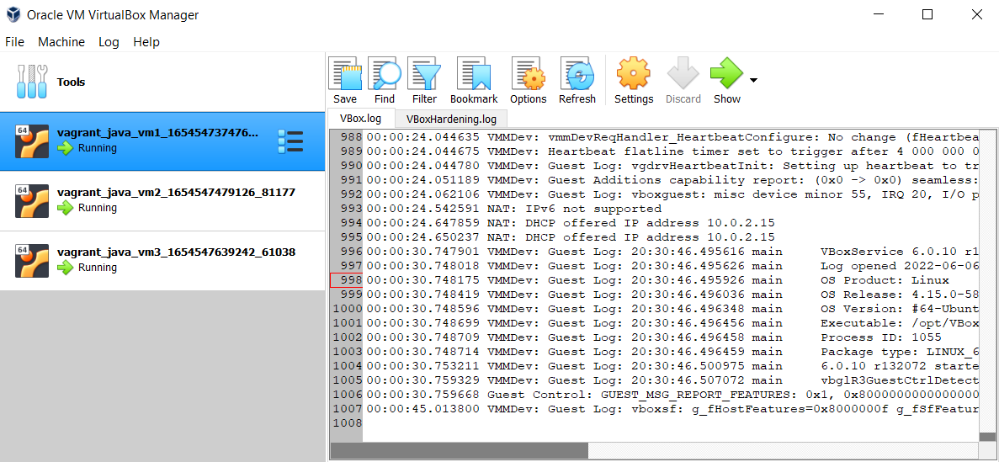
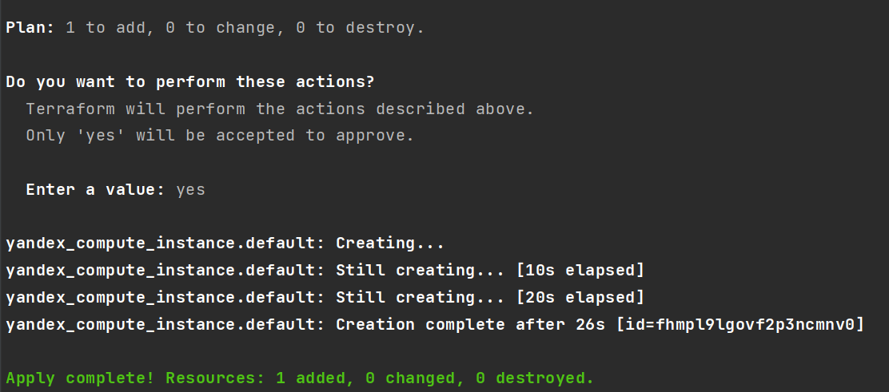

# Best Practices
## Code convention 
### General conventions
1. Use _ (underscore) instead of - (dash) everywhere (in resource names, data source names, variable names, outputs, etc).
2. Prefer to use lowercase letters and numbers (even though UTF-8 is supported).

### Resource and data source arguments

1. Resource name should be named this if there is no more descriptive and general name available, or if the resource module creates a single resource of this type (eg, in AWS VPC module there is a single resource of type aws_nat_gateway and multiple resources of typeaws_route_table, so aws_nat_gateway should be named this and aws_route_table should have more descriptive names - like private, public, database).
2. Always use singular nouns for names.
3. Use - inside arguments values and in places where value will be exposed to a human (eg, inside DNS name of RDS instance).
4. Include argument count / for_each inside resource or data source block as the first argument at the top and separate by newline after it.
5. Include argument tags, if supported by resource, as the last real argument, following by depends_on and lifecycle, if necessary. All of these should be separated by a single empty line.
6. When using conditions in an argumentcount / for_each prefer boolean values instead of using length or other expressions.
### Usage of `count` / `for_each`

```hcl
resource "aws_route_table" "public" {
  count = 2
  vpc_id = "vpc-12345678"
  # ... remaining arguments omitted
}
resource "aws_route_table" "private" {
  for_each = toset(["one", "two"])
  vpc_id = "vpc-12345678"
  # ... remaining arguments omitted
}
```

```hcl
resource "aws_route_table" "public" {
  vpc_id = "vpc-12345678"
  count  = 2
  # ... remaining arguments omitted
}
```

### Placement of `tags`

```hcl
resource "aws_nat_gateway" "this" {
  count = 2
  allocation_id = "..."
  subnet_id     = "..."
  tags = {
    Name = "..."
  }
  depends_on = [aws_internet_gateway.this]
  lifecycle {
    create_before_destroy = true
  }
}   
```

```hcl
resource "aws_nat_gateway" "this" {
  count = 2
  tags = "..."
  depends_on = [aws_internet_gateway.this]
  lifecycle {
    create_before_destroy = true
  }
  allocation_id = "..."
  subnet_id     = "..."
}
```

### Conditions in `count`

```hcl
resource "aws_nat_gateway" "that" {    # Best
  count = var.create_public_subnets ? 1 : 0
}
resource "aws_nat_gateway" "this" {    # Good
  count = length(var.public_subnets) > 0 ? 1 : 0
}
```

## Variables

1. Don't reinvent the wheel in resource modules: use `name`, `description`, and `default` value for variables as defined in the "Argument Reference" section for the resource you are working with.
2. Support for validation in variables is rather limited (e.g. can't access other variables or do lookups). Plan accordingly because in many cases this feature is useless.
3. Use the plural form in a variable name when type is `list(...)` or `map(...)`.
4. Order keys in a variable block like this: `description` , `type`, `default`, `validation`.
5. Always include `description` on all variables even if you think it is obvious (you will need it in the future).
6. Prefer using simple types (`number`, `string`, `list(...)`, `map(...)`, `any`) over specific type like `object()` unless you need to have strict constraints on each key.
7. Use specific types like `map(map(string))` if all elements of the map have the same type (e.g. `string`) or can be converted to it (e.g. `number` type can be converted to `string`).
8. Use type `any` to disable type validation starting from a certain depth or when multiple types should be supported.
9. Value `{}` is sometimes a map but sometimes an object. Use `tomap(...)` to make a map because there is no way to make an object.

## Outputs

Make outputs consistent and understandable outside of its scope (when a user is using a module it should be obvious what type and attribute of the value it returns).

1. The name of output should describe the property it contains and be less free-form than you would normally want.
2. Good structure for the name of output looks like `{name}_{type}_{attribute}` , where:
    1. `{name}` is a resource or data source name without a provider prefix. `{name}` for `aws_subnet` is `subnet`, for`aws_vpc` it is `vpc`.
    2. `{type}` is a type of a resource sources
    3. `{attribute}` is an attribute returned by the output
    
3. If the output is returning a value with interpolation functions and multiple resources, `{name}` and `{type}` there should be as generic as possible (`this` as prefix should be omitted). 
4. If the returned value is a list it should have a plural name.
5. Always include `description` for all outputs even if you think it is obvious.
6. Avoid setting `sensitive` argument unless you fully control usage of this output in all places in all modules.
7. Prefer `try()` (available since Terraform 0.13) over `element(concat(...))` (legacy approach for the version before 0.13)

### Code examples of `output`

Return at most one ID of security group:

```hcl
output "security_group_id" {
  description = "The ID of the security group"
  value       = try(aws_security_group.this[0].id, aws_security_group.name_prefix[0].id, "")
}
```

When having multiple resources of the same type, `this` should be omitted in the name of output:

```hcl
output "this_security_group_id" {
  description = "The ID of the security group"
  value       = element(concat(coalescelist(aws_security_group.this.*.id, aws_security_group.web.*.id), [""]), 0)
}
```

### Use plural name if the returning value is a list

```hcl
output "rds_cluster_instance_endpoints" {
  description = "A list of all cluster instance endpoints"
  value       = aws_rds_cluster_instance.this.*.endpoint
}
```

# Screenshot with 3 VMs

# Screenshot with repo and default branch


# Screenshots of VM creating log 
 Terraform log, when creating virtual machine. 


Yandex cloud console screenshot 


