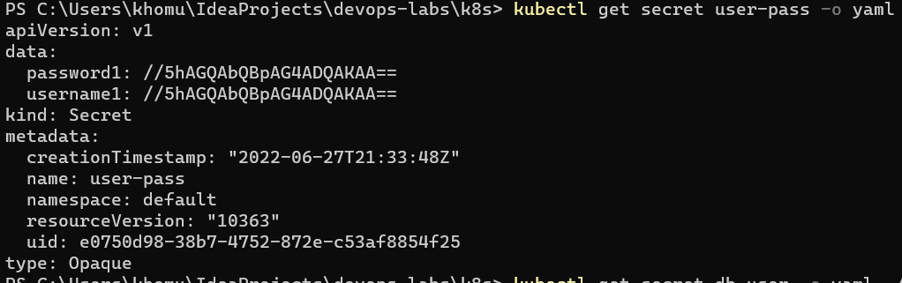

# K8s secrets and resources

## Creating secret
1. Adding secret to kubernetes


2. Get secret


3. Decoding


## Using Helm
1. Encrypting creds in secrets1.yaml

2. Adding secret.yaml to templates

```kubernetes helm
apiVersion: v1
kind: Secret
metadata:
  name: user-pass
  namespace: default
  labels:
    app: java-app
type: Opaque
data:
  password1: {{ .Values.password1 | b64enc | quote }}
  username1: {{ .Values.username1 | b64enc | quote }}
```
3. Check secrets from pod


## Limits

1. Adding limits in values.yaml
2. Inspect pod

