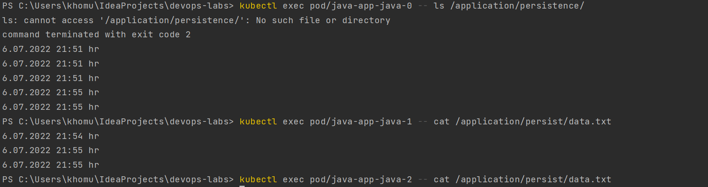

# K8s StatefulSet

## Command outputs
1. Command `kubectl get po,sts,svc,pvc`

2. Screenshot with showing file output 

3. The differences between the output of the command for replicas.

The reason for it lies in the fact that every pod run own instance of the application.
While we are trying to access the service via network, k8s balance the load, so 
we can access different pods. Every pod writes the logs to its own file. 
Basically we work with stateful service.

4. For our app ordering guarantee are unnecessary. Describe in the report why.

There are no dependencies among replicas, and pods are independent of each other. 
So they can run in parallel.