# Monitoring in k8s

## Components of kube-prometheus Stack

### Prometheus Operator
Helps to deploy and manage Prometheus, Alertmanager and related resources. 

### Prometheus 
Full-fledge service with tons of integration helping to keep time-serial data,
metrics for monitoring purposes as well as for generating alarms

### Alertmanager
Alert handler which further redirect the signal to various services like emails and others

### Prometheus node-exporter 
Helps to get hardware and OS metrics from *NIX kernel, so them could be monitored in Grafana.

### Prometheus Adapter for Kubernetes Metrics APIs
Helps to get metrics from Kubernetes Metrics APIs, also can replace Kubernetes metric server with Prometheus 

### Kube-state-metrics (KSM)
Service, which listens Kubernetes API and provide metrics about state of inner objects, such as deployments, nodes and pods. 

### Grafana
User Interface to represent data collected by Prometheus and other services

## Get Kubernetes information 
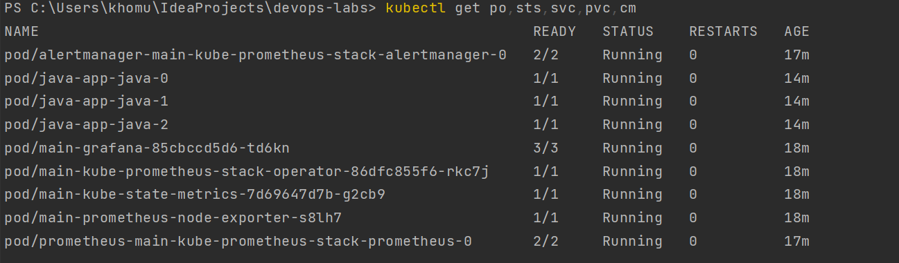

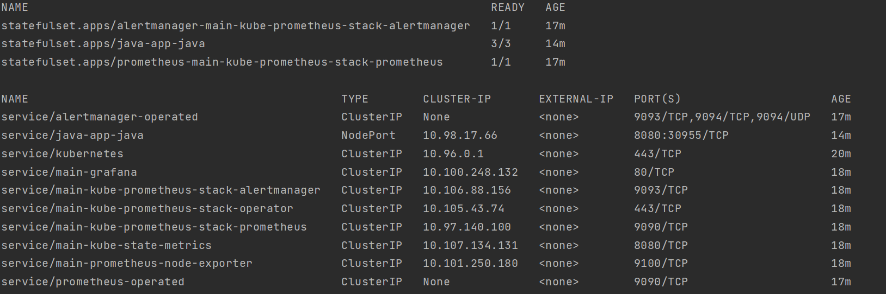

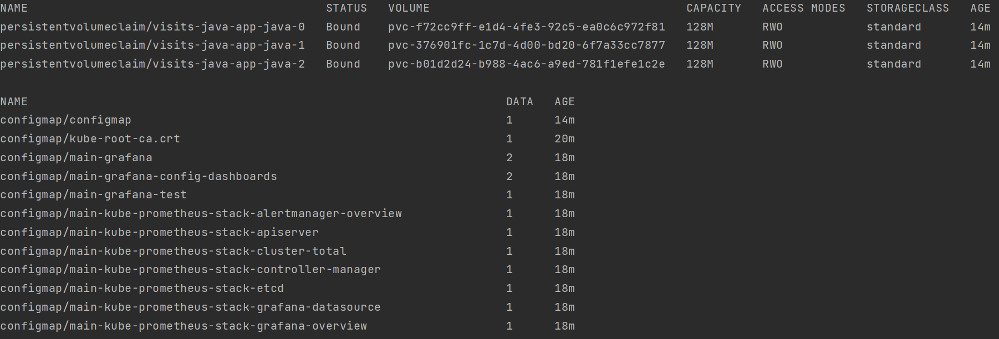

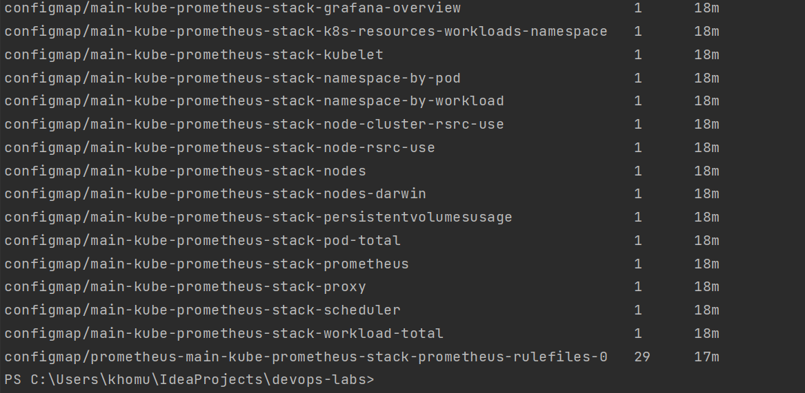
## Information about cluster
### Check how much CPU and Memory your StatefulSet is consuming.

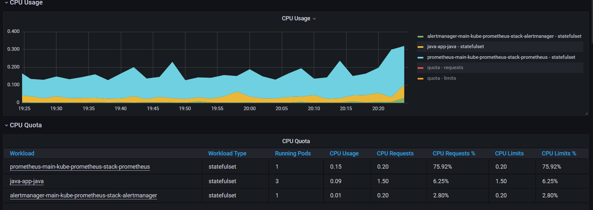

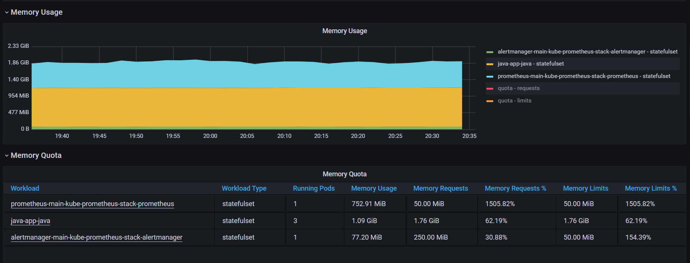
### Check which Pod is using CPU more than others and which is less in the default namespace.

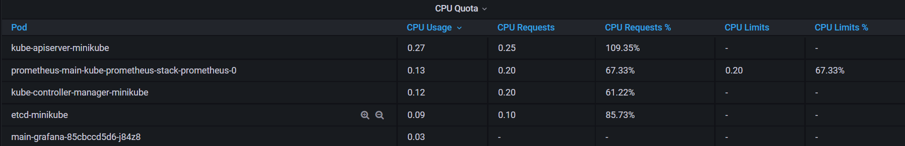

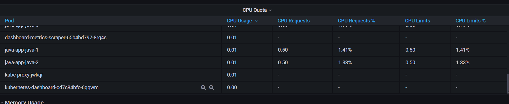

### Check how much memory is used on your node, in % and mb.

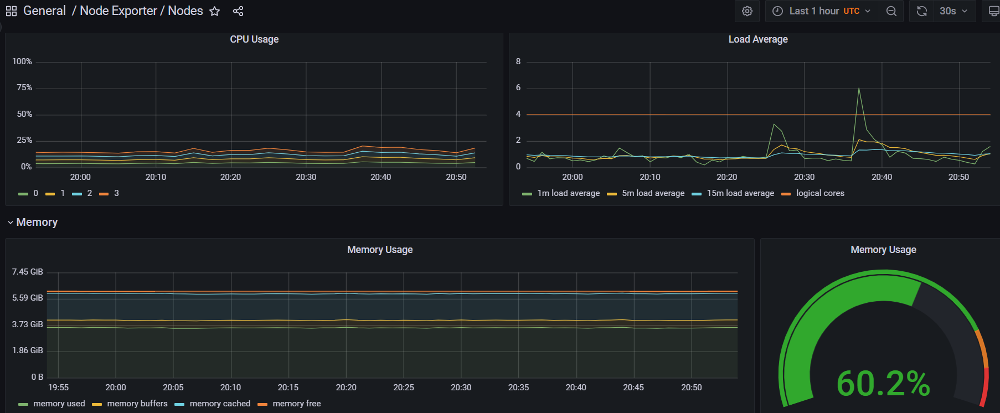

### Check how many pods and containers actually ran by the Kubelet service.

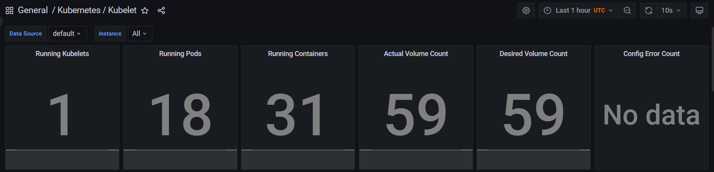

### Check which Pod is using network more than others and which is less in the default namespace.

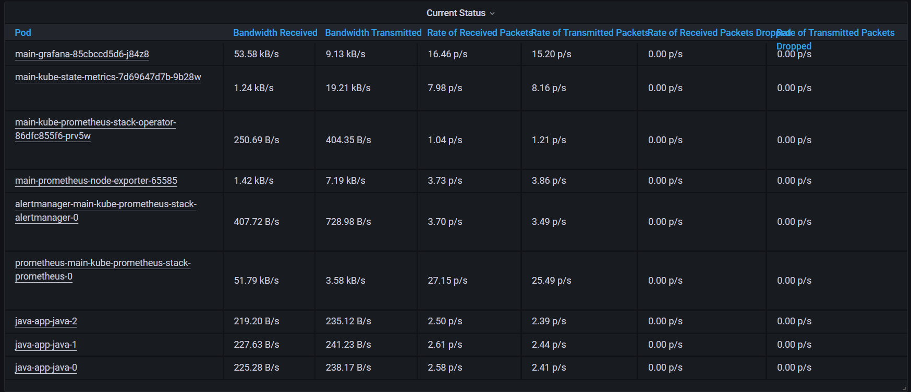

### Check how many alerts you have. Also you can see them in the Web UI by the minikube service monitoring-kube-prometheus-alertmanager command.
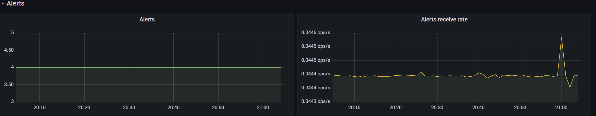

## Init containers proof

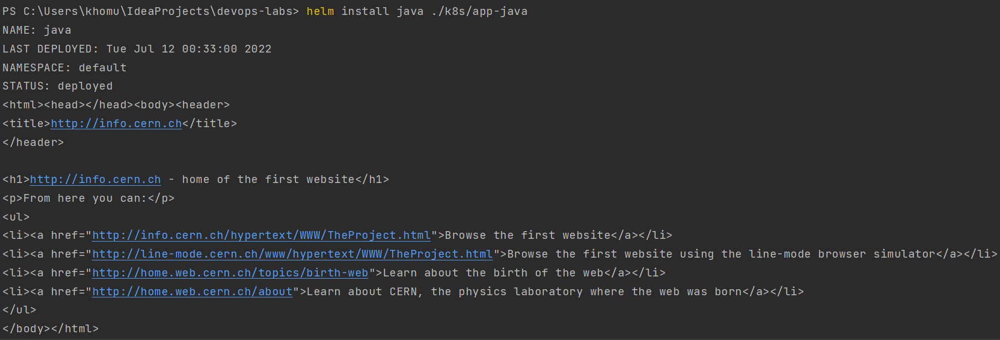