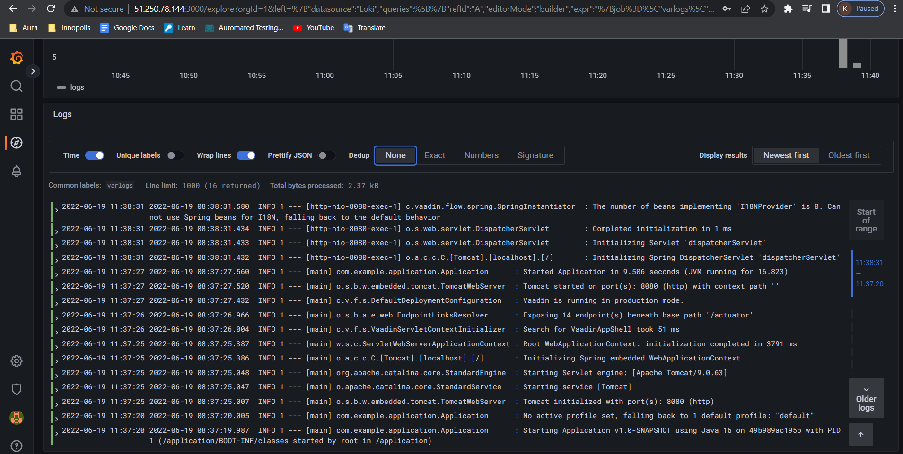

## Screenshots

## Best practises 

1. Avoid logging superfluous data, especially sensitive data 
like credits and secrets
2. Aggregate and centralise logs. Basically, instead of keeping everything locally
on various virtual machines, better to have one aggregator, which would handle 
all of them. Thus, process of looking for issue would be easier, because all one need 
could be found in single place
3. Index logs. It is required to improve performance over querying for logs
4. Realtime monitoring and alerts. Having all in place could help to identify failure swiftly.
5. Optimize log retention policy. Some logs should live much longer than other,
so it should be addressed from architecture view, so no logs overhead is created. 
6. Structured logging. Adding JSON entries with data will make them available to parse it easier,
and then searching and filtering seamlessly.